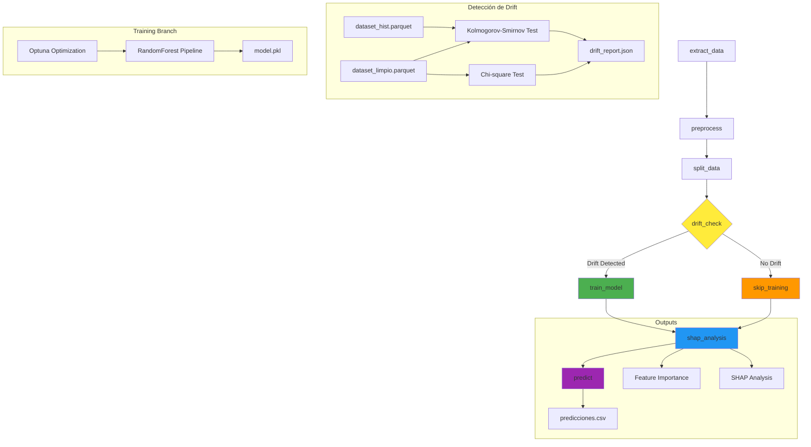
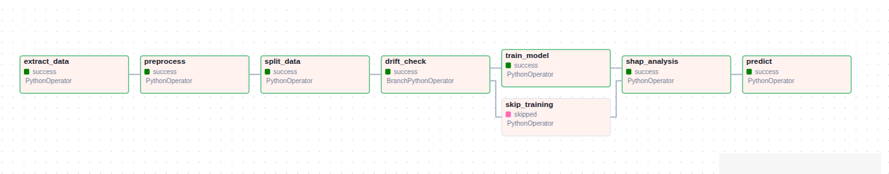

# Pipeline MLOps - SodAI Purchase Prediction

Sasha Oyanadel

Pablo Vergara

## Descripción General

Este documento describe el pipeline MLOps completo para el sistema de predicción de compras de SodAI, implementado con Apache Airflow. El pipeline está diseñado para ejecutarse semanalmente, detectar drift en los datos, reentrenar modelos cuando sea necesario y generar predicciones automatizadas.

## Arquitectura del DAG

### Información General del DAG

* **Nombre** : `sodai_mlops`
* **Frecuencia** : Semanal (lunes a las 9:00 AM) - `'0 9 * * 1'`
* **Owner** : `sodai_team`
* **Tags** : `['mlops', 'drift']`

### Configuración de Directorios

```
/tmp/airflow_tmp/
├── data/                 # Datos de entrada y procesados
├── outputs/              # Resultados del pipeline
│   ├── models/          # Modelos entrenados
│   └── shap/            # Análisis de interpretabilidad
├── tmp/                 # Archivos temporales
└── mlruns/              # Logs de MLflow
```

## Descripción Detallada de Tareas

### 1. **extract_data** 📥

 **Tipo** : PythonOperator

 **Función** : `extract_task()`

* **Propósito** : Carga y prepara los archivos parquet nuevos para el pipeline
* **Entrada** : Archivos raw en `DATA_DIR`
* **Salida** : Datos listos para procesamiento
* **Dependencias** : Ninguna (tarea inicial)

### 2. **preprocess** 🔄

 **Tipo** : PythonOperator

 **Función** : `preprocess_task()`

* **Propósito** : Limpieza y transformación de datos
* **Proceso** :
* Carga `transacciones.parquet`, `clientes.parquet`, `productos.parquet`
* Aplica `preprocess_data()` que realiza:
  * Eliminación de duplicados
  * Conversión de fechas a períodos semanales
  * Joins entre tablas
  * Creación de matriz customer-product-week
  * Generación de variable target `comprado`
* **Entrada** : Archivos parquet raw
* **Salida** : `dataset_limpio.parquet`

### 3. **split_data** ✂️

 **Tipo** : PythonOperator

 **Función** : `split_task()`

* **Propósito** : Partición temporal de datos
* **Proceso** :
* Aplica `split_temporal()` con ratios:
  * Train: 70%
  * Validation: 15%
  * Test: 15%
* Respeta la cronología temporal (no hay data leakage)
* **Entrada** : `dataset_limpio.parquet`
* **Salida** : `train.parquet`, `val.parquet`, `test.parquet`

### 4. **drift_check** 🔍

 **Tipo** : BranchPythonOperator

 **Función** : `drift_check_task()`

* **Propósito** : Detección automática de drift
* **Proceso** :
* Compara `dataset_hist.parquet` vs `dataset_limpio.parquet`
* Tests estadísticos:
  * **Kolmogorov-Smirnov** : Para variables numéricas
  * **Chi-cuadrado** : Para variables categóricas
* Threshold configurable (default: 0.05)
* **Decisión de Branching** :
* Si `drift_detected = True` → `train_model`
* Si `drift_detected = False` → `skip_training`
* **Salida** : `drift_report.json`

### 5a. **train_model** 🤖

 **Tipo** : PythonOperator

 **Función** : `train_task()`

* **Propósito** : Entrenamiento del modelo cuando hay drift
* **Proceso** :
* Optimización de hiperparámetros con Optuna (30 trials)
* Modelo: RandomForest con pipeline de preprocesamiento
* Features utilizadas:
  * **Numéricas** : `region_id`, `Y`, `X`, `num_deliver_per_week`, `num_visit_per_week`, `size`
  * **Categóricas** : `customer_type`, `brand`, `category`, `sub_category`, `segment`, `package`
  * **Temporales** : `week` (extrae semana del año)
* Técnicas de preprocesamiento:
  * Winsorization para outliers
  * StandardScaler para numéricas
  * OneHotEncoder para categóricas
  * KBinsDiscretizer para variables específicas
* **Métricas** : Average Precision, Precision, Recall, F1-Score
* **Salida** : `model.pkl`, `training_results.json`

### 5b. **skip_training** ⏭️

 **Tipo** : PythonOperator

 **Función** : `skip_training_task()`

* **Propósito** : Placeholder cuando no se detecta drift
* **Proceso** : No realiza acciones, solo continúa el flujo
* **Condición** : Se ejecuta cuando `drift_detected = False`

### 6. **shap_analysis** 📊

 **Tipo** : PythonOperator

 **Función** : `shap_task()`

 **Trigger Rule** : `NONE_FAILED_MIN_ONE_SUCCESS`

* **Propósito** : Análisis de interpretabilidad del modelo
* **Proceso** :
* Feature Importance (RandomForest nativo)
* Permutation Importance
* Partial Dependence Plots
* Estadísticas detalladas en JSON
* **Entrada** : `model.pkl`, `val.parquet`
* **Salida** : Gráficos PNG y `interpretability_stats.json` en `/outputs/shap/`

### 7. **predict** 🔮

 **Tipo** : PythonOperator

 **Función** : `predict_task()`

 **Trigger Rule** : `NONE_FAILED_MIN_ONE_SUCCESS`

* **Propósito** : Generación de predicciones para la próxima semana
* **Proceso** :
* Crea todas las combinaciones customer-product para next_week
* Aplica el modelo entrenado
* Filtra predicciones positivas (probabilidad > 0.5)
* Ordena por probabilidad descendente
* **Entrada** : `model.pkl`, `dataset_limpio.parquet`
* **Salida** : `predicciones.csv`

## Diagrama de Flujo del Pipeline



## Representación Visual del DAG en Airflow



### Estados del DAG

* 🟢  **Verde** : Tarea completada exitosamente
* 🟡  **Amarillo** : Tarea en ejecución
* 🔴  **Rojo** : Tarea fallida
* ⚪  **Gris** : Tarea no ejecutada (skipped)
* 🔵  **Azul** : Tarea programada

## Lógica de Integración de Datos Futuros y Detección de Drift

### 1. **Flujo Semanal Automatizado**

El sistema está diseñado para ejecutarse **automáticamente cada lunes a las 9:00 AM** y revisar si hay datos nuevos disponibles:

<pre><div class="relative group/copy rounded-lg"><div class="sticky opacity-0 group-hover/copy:opacity-100 top-2 py-2 h-12 w-0 float-right"><div class="absolute right-0 h-8 px-2 items-center inline-flex"><button class="inline-flex
  items-center
  justify-center
  relative
  shrink-0
  can-focus
  select-none
  disabled:pointer-events-none
  disabled:opacity-50
  disabled:shadow-none
  disabled:drop-shadow-none text-text-300
          border-transparent
          transition
          font-styrene
          duration-300
          ease-[cubic-bezier(0.165,0.85,0.45,1)]
          hover:bg-bg-400
          aria-pressed:bg-bg-400
          aria-checked:bg-bg-400
          aria-expanded:bg-bg-300
          hover:text-text-100
          aria-pressed:text-text-100
          aria-checked:text-text-100
          aria-expanded:text-text-100 h-8 w-8 rounded-md active:scale-95 backdrop-blur-md" type="button" aria-label="Copy to clipboard" data-state="closed"><div class="relative"><svg xmlns="http://www.w3.org/2000/svg" width="14" height="14" fill="currentColor" viewBox="0 0 256 256" class="transition-all opacity-100 scale-100"><path d="M200,32H163.74a47.92,47.92,0,0,0-71.48,0H56A16,16,0,0,0,40,48V216a16,16,0,0,0,16,16H200a16,16,0,0,0,16-16V48A16,16,0,0,0,200,32Zm-72,0a32,32,0,0,1,32,32H96A32,32,0,0,1,128,32Zm72,184H56V48H82.75A47.93,47.93,0,0,0,80,64v8a8,8,0,0,0,8,8h80a8,8,0,0,0,8-8V64a47.93,47.93,0,0,0-2.75-16H200Z"></path></svg><svg xmlns="http://www.w3.org/2000/svg" width="14" height="14" fill="currentColor" viewBox="0 0 256 256" class="absolute top-0 left-0 transition-all opacity-0 scale-50"><path d="M229.66,77.66l-128,128a8,8,0,0,1-11.32,0l-56-56a8,8,0,0,1,11.32-11.32L96,188.69,218.34,66.34a8,8,0,0,1,11.32,11.32Z"></path></svg></div></button></div></div><div class="text-text-500 text-xs p-3.5 pb-0">python</div><div class=""><pre class="code-block__code !my-0 !rounded-lg !text-sm !leading-relaxed"><code class="language-python"><span><span>schedule_interval</span><span class="token">=</span><span class="token">'0 9 * * 1'</span><span></span><span class="token"># Lunes 9:00 AM</span></span></code></pre></div></div></pre>

 **Proceso de Revisión Semanal** :

1. **Extracción** : Busca nuevos archivos parquet en `DATA_DIR`
2. **Validación** : Verifica que existan `transacciones.parquet`, `clientes.parquet`, `productos.parquet`
3. **Procesamiento** : Si hay datos nuevos, los procesa automáticamente
4. **Comparación** : Compara contra datos históricos para detectar drift

### 2. **Gestión de Datos Nuevos**

<pre><div class="relative group/copy rounded-lg"><div class="sticky opacity-0 group-hover/copy:opacity-100 top-2 py-2 h-12 w-0 float-right"><div class="absolute right-0 h-8 px-2 items-center inline-flex"><button class="inline-flex
  items-center
  justify-center
  relative
  shrink-0
  can-focus
  select-none
  disabled:pointer-events-none
  disabled:opacity-50
  disabled:shadow-none
  disabled:drop-shadow-none text-text-300
          border-transparent
          transition
          font-styrene
          duration-300
          ease-[cubic-bezier(0.165,0.85,0.45,1)]
          hover:bg-bg-400
          aria-pressed:bg-bg-400
          aria-checked:bg-bg-400
          aria-expanded:bg-bg-300
          hover:text-text-100
          aria-pressed:text-text-100
          aria-checked:text-text-100
          aria-expanded:text-text-100 h-8 w-8 rounded-md active:scale-95 backdrop-blur-md" type="button" aria-label="Copy to clipboard" data-state="closed"><div class="relative"><svg xmlns="http://www.w3.org/2000/svg" width="14" height="14" fill="currentColor" viewBox="0 0 256 256" class="transition-all opacity-100 scale-100"><path d="M200,32H163.74a47.92,47.92,0,0,0-71.48,0H56A16,16,0,0,0,40,48V216a16,16,0,0,0,16,16H200a16,16,0,0,0,16-16V48A16,16,0,0,0,200,32Zm-72,0a32,32,0,0,1,32,32H96A32,32,0,0,1,128,32Zm72,184H56V48H82.75A47.93,47.93,0,0,0,80,64v8a8,8,0,0,0,8,8h80a8,8,0,0,0,8-8V64a47.93,47.93,0,0,0-2.75-16H200Z"></path></svg><svg xmlns="http://www.w3.org/2000/svg" width="14" height="14" fill="currentColor" viewBox="0 0 256 256" class="absolute top-0 left-0 transition-all opacity-0 scale-50"><path d="M229.66,77.66l-128,128a8,8,0,0,1-11.32,0l-56-56a8,8,0,0,1,11.32-11.32L96,188.69,218.34,66.34a8,8,0,0,1,11.32,11.32Z"></path></svg></div></button></div></div><div class="text-text-500 text-xs p-3.5 pb-0">python</div><div class=""><pre class="code-block__code !my-0 !rounded-lg !text-sm !leading-relaxed"><code class="language-python"><span><span class="token">def</span><span></span><span class="token">preprocess_task</span><span class="token">(</span><span class="token">)</span><span class="token">:</span><span>
</span></span><span><span></span><span class="token"></span><span>
</span></span><span><span>    transacciones </span><span class="token">=</span><span> pd</span><span class="token">.</span><span>read_parquet</span><span class="token">(</span><span class="token string-interpolation">f"</span><span class="token string-interpolation interpolation">{</span><span class="token string-interpolation interpolation">DATA_DIR</span><span class="token string-interpolation interpolation">}</span><span class="token string-interpolation">/transacciones.parquet"</span><span class="token">)</span><span>
</span></span><span><span>    clientes </span><span class="token">=</span><span> pd</span><span class="token">.</span><span>read_parquet</span><span class="token">(</span><span class="token string-interpolation">f"</span><span class="token string-interpolation interpolation">{</span><span class="token string-interpolation interpolation">DATA_DIR</span><span class="token string-interpolation interpolation">}</span><span class="token string-interpolation">/clientes.parquet"</span><span class="token">)</span><span> 
</span></span><span><span>    productos </span><span class="token">=</span><span> pd</span><span class="token">.</span><span>read_parquet</span><span class="token">(</span><span class="token string-interpolation">f"</span><span class="token string-interpolation interpolation">{</span><span class="token string-interpolation interpolation">DATA_DIR</span><span class="token string-interpolation interpolation">}</span><span class="token string-interpolation">/productos.parquet"</span><span class="token">)</span><span>
</span></span><span>  
</span><span><span></span><span class="token"></span><span>
</span></span><span><span>    df_final </span><span class="token">=</span><span> preprocess_data</span><span class="token">(</span><span>transacciones</span><span class="token">,</span><span> clientes</span><span class="token">,</span><span> productos</span><span class="token">)</span></span></code></pre></div></div></pre>

 **Características del Sistema** :

* **Automatización completa** : No requiere intervención manual
* **Datos estáticos** : Procesa archivos parquet depositados en directorio específico
* **Validación automática** : Verifica existencia de archivos requeridos

### 3. **Detección de Drift**

El sistema implementa detección automática de drift para determinar cuándo reentrenar:

**Variables Numéricas** (Kolmogorov-Smirnov):

```python
stat, pvalue = ks_2samp(ref_values, new_values)
drift_detected = pvalue < threshold  # default: 0.05
```

**Variables Categóricas** (Chi-cuadrado):

```python
chi2, pvalue, dof, expected = chi2_contingency(contingency_table)
drift_detected = pvalue < threshold
```

 **Criterios de Drift** :

* **Threshold** : p-value < 0.05 (configurable)
* **Mínimo de muestras** : 30 por variable
* **Reporte detallado** : JSON con estadísticas por variable

### **4.Estrategia de Reentrenamiento**

pre>

```text
┌─────────────────┐
│  Nuevos Datos   │
└────────┬────────┘
         │
         ▼
┌─────────────────────┐
│  Detección de Drift │
└────────┬────────────┘
         │
         ▼
┌───────────────────────────┐
│ ¿Drift Detectado?         │
└───────────┬───────────────┘
            │
   ┌────────┴─────────┐
   │                  │
   ▼                  ▼
┌────────────────┐  ┌─────────────────────┐
│ Reentrenar     │  │ Usar Modelo         │
│  Modelo        │  │ Existente           │
└─────┬──────────┘  └─────────┬───────────┘
      │                      │
      ▼                      │
┌───────────────┐            │
│ Optuna        │            │
│ (30 trials)   │            │
└─────┬─────────┘            │
      ▼                      │
┌────────────────────┐       │
│ Guardar Nuevo      │       │
│ Modelo             │       │
└─────┬──────────────┘       │
      └──────────────┬───────┘
                     ▼
           ┌───────────────────────┐
           │ Predicciones          │
           │ Próxima Semana        │
           └───────────────────────┘
```

</pre>

 **Métricas Rastreadas** :

* Porcentaje de drift por variable
* Número total de variables con drift
* Rendimiento del modelo (Average Precision)
* Estadísticas de predicción

 **Archivos de Monitoreo** :

* `drift_report.json`: Reporte detallado de drift
* `training_results.json`: Métricas de entrenamiento
* `interpretability_stats.json`: Análisis de features

## Configuración y Ejecución

### Variables de Entorno Requeridas

```bash
AIRFLOW_HOME=/path/to/airflow
PYTHONPATH=/path/to/project/scripts
```

### Estructura de Archivos Esperada

```
/tmp/airflow_tmp/data/
├── transacciones.parquet    # Datos nuevos de transacciones
├── clientes.parquet         # Información de clientes
├── productos.parquet        # Catálogo de productos
└── dataset_hist.parquet     # Dataset histórico (drift detection)
```

### Parámetros Configurables

| Parámetro           | Valor Default | Descripción                     |
| -------------------- | ------------- | -------------------------------- |
| `threshold`        | 0.05          | P-value para detección de drift |
| `weeks_to_include` | 4             | Semanas históricas a incluir    |
| `n_trials`         | 30            | Trials de optimización Optuna   |
| `min_samples`      | 30            | Muestras mínimas para tests     |

## Mantenimiento y Troubleshooting

### Logs Importantes

1. **Drift Detection** : Revisa `/outputs/drift_report.json`
2. **Training** : Consulta `/outputs/models/training_results.json`
3. **Predictions** : Verifica tamaño y distribución en `/outputs/predicciones.csv`

### Posibles Errores

| Error                       | Causa                  | Solución                        |
| --------------------------- | ---------------------- | -------------------------------- |
| `FileNotFoundError`       | Datos faltantes        | Verificar estructura de archivos |
| `Drift threshold too low` | Threshold muy estricto | Ajustar threshold en código     |
| `Memory issues`           | Dataset muy grande     | Implementar sampling en training |
| `Feature mismatch`        | Cambios en schema      | Actualizar preprocessing         |
